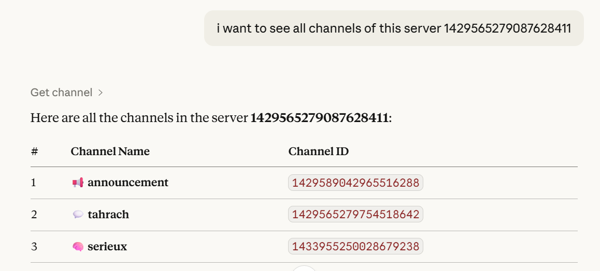
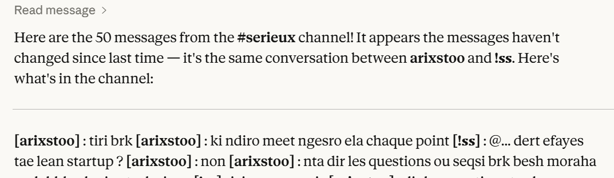
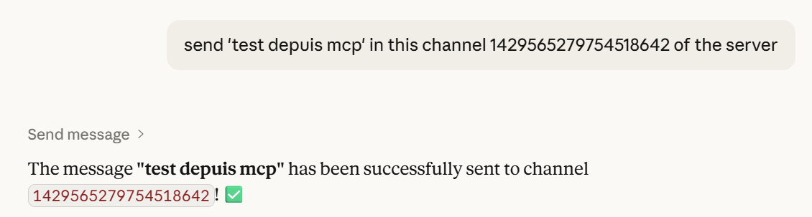

# Discord MCP Server 

Connect **Claude Desktop** to **Discord** using MCP (Model Context Protocol).

---

##  Features

- `get_channel` — list channels  
- `read_message` — read messages  
- `send_message` — send messages  

---

##  Architecture

```
Claude → MCP Server → Discord Bot → Discord
```

---

##  Structure

```text
MCP DISCORD/
├── server.py
├── assets/
│   ├── list_channels.png
│   ├── read_messages.png
│   └── send_message.png
├── .env
├── pyproject.toml
└── README.md
```

---

##  Screenshots

### List Channels


### Read Messages


### Send Message


---

##  Setup

### Install

```bash
uv sync
```

or

```bash
pip install mcp discord.py python-dotenv pydantic
```

---

### Discord Bot

- Create bot: https://discord.com/developers/applications  
- Enable:
  - Message Content Intent  
  - Server Members Intent  
- Invite with permissions:
  - View Channels  
  - Send Messages  
  - Read Message History  

---

### `.env`

```env
DISCORD_TOKEN=your_token_here
```

---

### Claude Config

```json
{
  "mcpServers": {
    "discord": {
      "command": "uv",
      "args": [
        "--directory",
        "C:/path/to/MCP DISCORD",
        "run",
        "server.py"
      ],
      "env": {
        "DISCORD_TOKEN": "your_token"
      }
    }
  }
}
```

---

##  Run

```bash
uv run server.py
```

---

##  Examples

```
List channels in server 123
Read last 10 messages from channel 456
Send "Hello" to channel 456
```

---

##  Notes

- Don’t share your token  
- Reset it if leaked  

---

##  License

MIT 
---

##  Author

*Dioubi Issam* Ai developer
